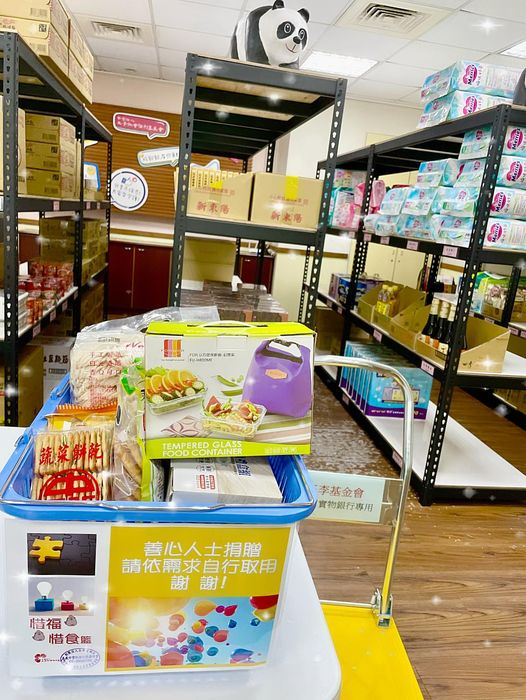

---
title: 實物銀行捐贈 
date: 2024-06-07 12:35:00 
top:
tags:
- [實物銀行捐贈]
categories:
- [實物銀行捐贈]
---------------------------------------------
 # **<a href="#" style="color: #ca3333;">王李基金會 嘉義市實物銀行</a>**
 實物銀行的物資主要來自社會大眾的捐贈，最大宗的捐贈來源來自於每3個月捐贈一次的期貨交易所及統一企業 ，每季來到第三個月，實物銀行的架上幾乎都要空了，雖然嘉義市政府 也幫忙採購一些物資來補充，但面對越來越多亟需物資補助的弱勢家庭，實物銀行現有的物資仍不足以提供到每一位服務對象的需求… 
 感謝善心人士黃0博先生一次又一次的主動來到嘉義市實物銀行以媽媽彭女士的名義捐贈麵條、飲品、餅乾⋯等，數量雖然不多，但也能給來到實物銀行的服務對象一點小確幸⋯謝謝您 
 惜福愛物 分享感恩  
<!--more-->

