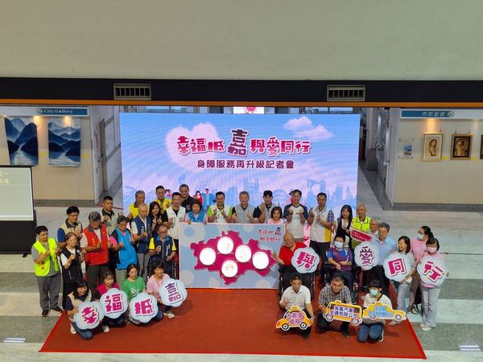
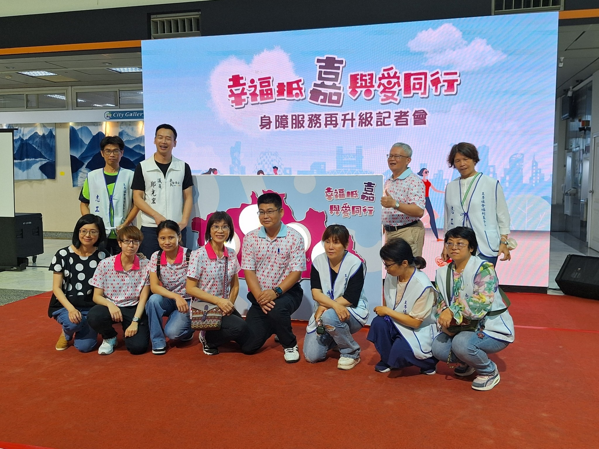
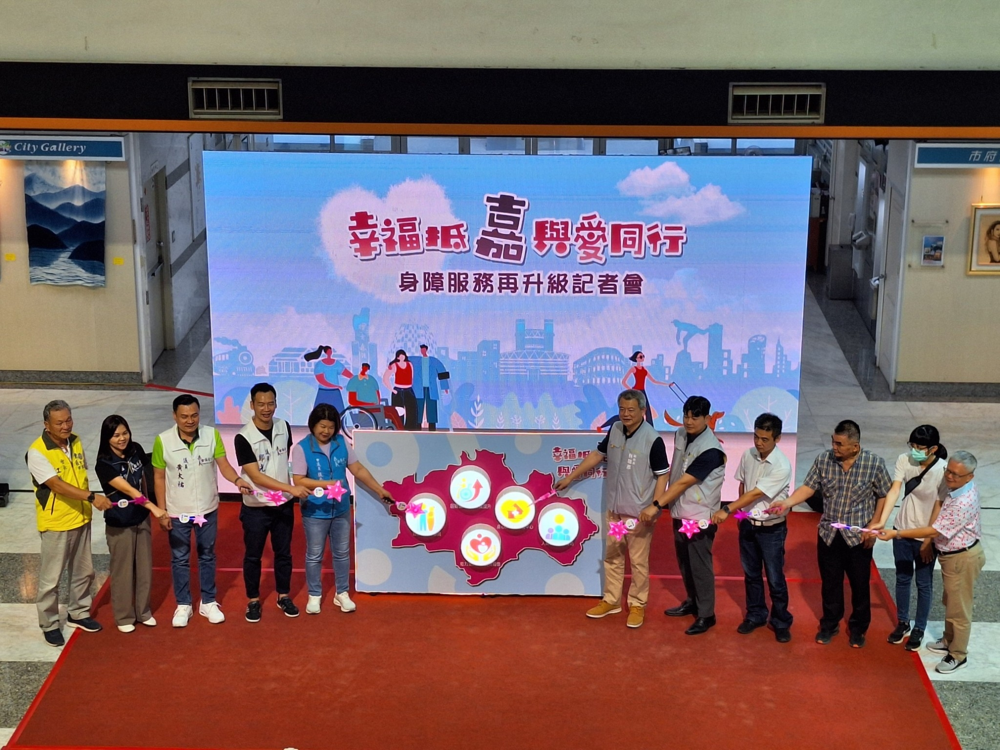
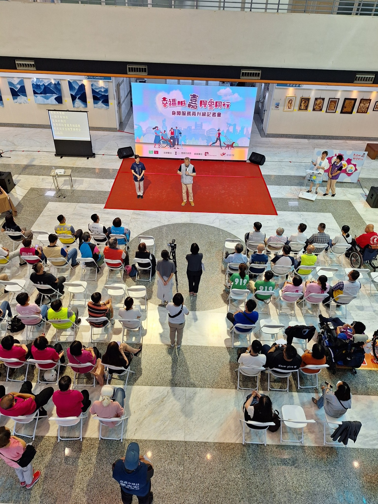
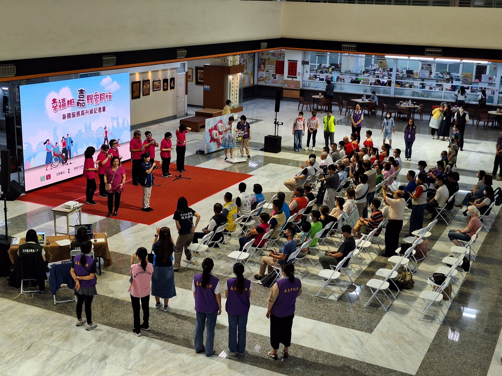
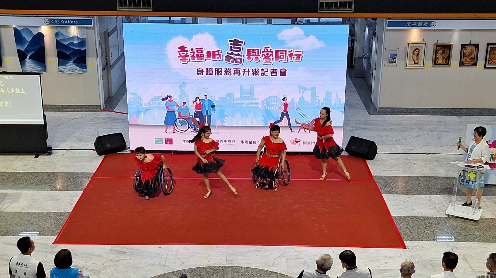
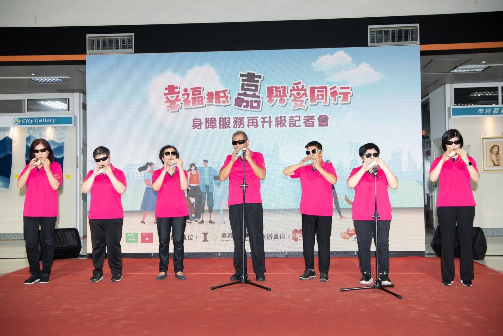
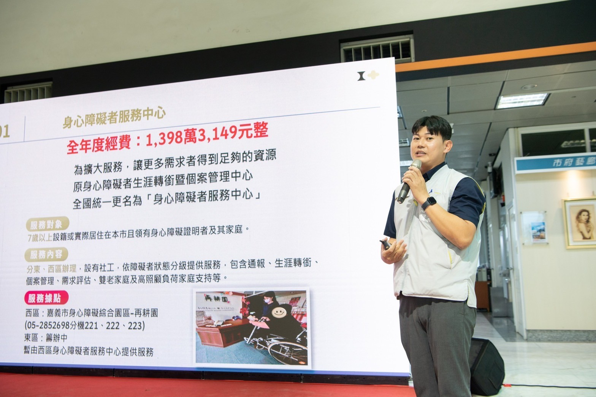
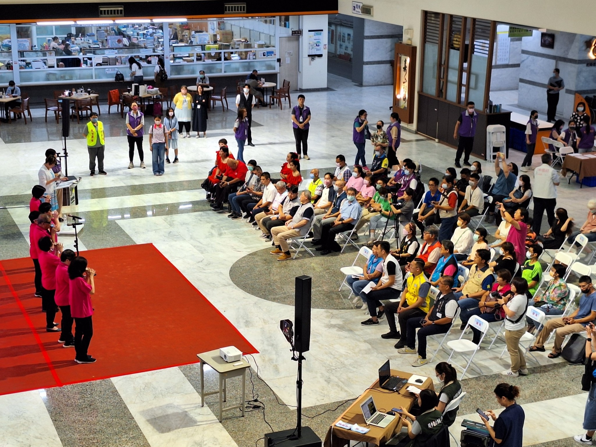

---
title: 幸福抵嘉與愛同行身障服務再升級記者會 
date: 2024-06-19 13:06:50 
top:
tags:
- [身心障礙者自立及社會參與計畫]
categories:
- [身心障礙者自立及社會參與計畫]
---------------------------------------------
 # **<a href="#" style="color: #ca3333;">"幸福抵嘉與愛同行" 身障服務再升級記者會</a>**
 　　王李基金會接受嘉義市政府委託辦理嘉義市113年促進身心障礙者自立及社會參與計畫 於今(19)日在市府舉辦幸福抵嘉與愛同行身障服務再升級記者會，今日嘉義市大家長 勇媽阿惠 - 黃敏惠雖因另有要公，未能親臨主持記者會，但關心身心障礙朋友的心始終如一。 
 　　嘉義市府為提升身心障礙照顧服務，今年投入8億餘元預算推動各項身心障礙者福利服務，副市長林瑞彥主持身障服務再升級記者會 ，宣佈今年公益彩券預算增加7千多萬元，推動辦理「身心障礙者服務中心」、 推動「自立及社會參與」溫馨接送服務、「困難個案照顧品質提升」及「培力暨高照顧負荷關懷」 等方案。更領先各縣市推出 「身心障礙機構服務人員留才久任補助」方案，加碼補助薪資留下照護人才，公私齊力為身心障礙者福利及權益努力，落實身心障礙者權利公約精神，打造「全齡共享、世代宜居」幸福嘉義市。 
 　　交通移動是身心障礙者取得生活資源和社會參與的重要媒介，為落實身心障礙者「自立生活融入社區」，首推「自立及社會參與溫馨接送服務」，協助 中度以上視障、肢障或多重障礙（含視障或肢障）者就醫、就學、就業、外出洽公、購物、聚餐或旅遊等，踏出家門參與社會藝文或公益活動。設籍嘉義市且領有中度以上視障、肢障或多重障礙（含視障或肢障）證明者皆可於上班時間，備身分證、身心障礙證明及印章至王李基金會 設於再耕園(嘉義市玉山路160號)1樓申領乘車券，或電05-2356175洽詢，將有專人為您服務。 

嘉義市政府：[https://www.facebook.com/share/p/RPZzoE9GuRjwMnTZ/?mibextid=WC7FNe](https://www.facebook.com/share/p/RPZzoE9GuRjwMnTZ/?mibextid=WC7FNe)

自由時報：[https://news.ltn.com.tw/news/ChiayiCity/breakingnews/4710453](https://www.facebook.com/share/p/RPZzoE9GuRjwMnTZ/?mibextid=WC7FNe)
<!--more-->

