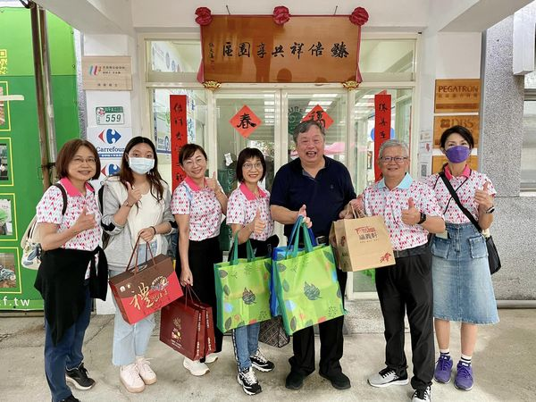
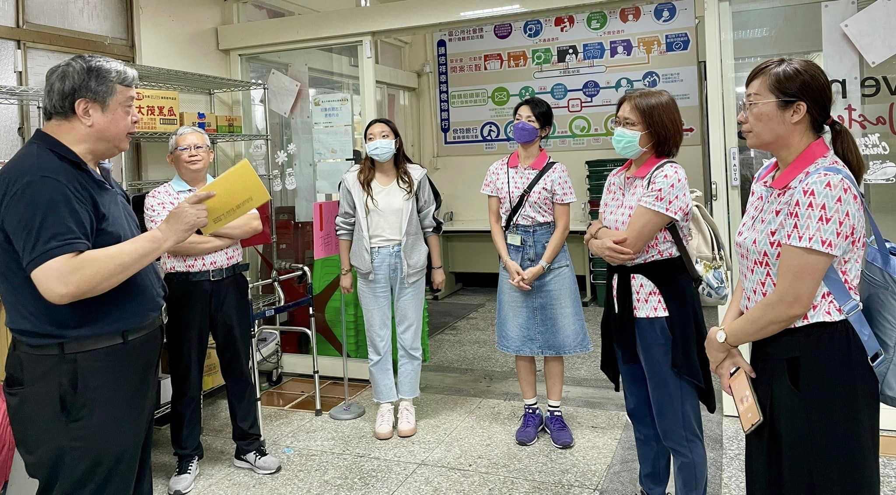
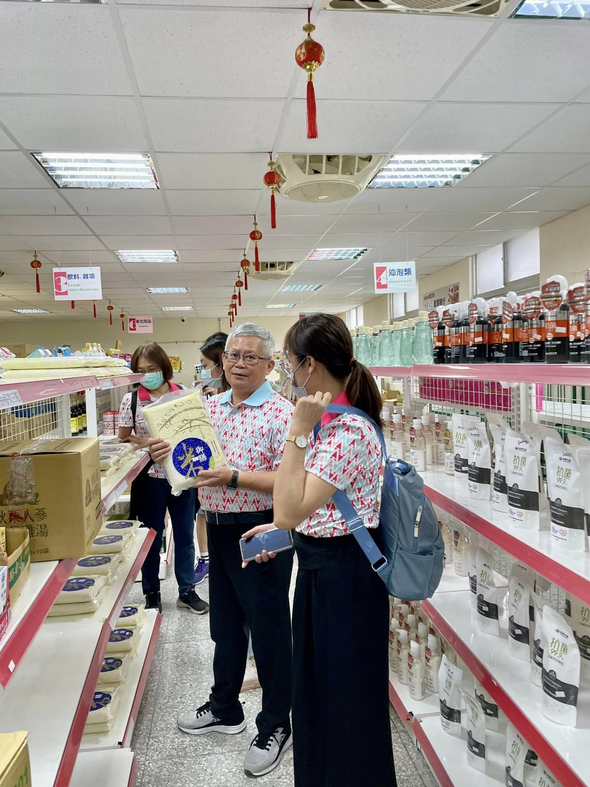
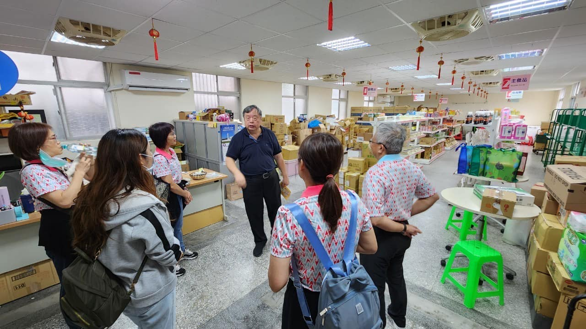
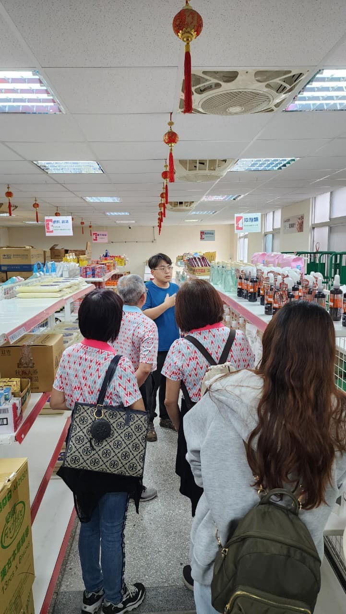
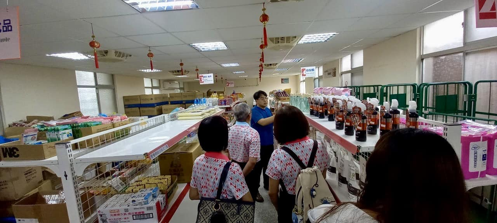
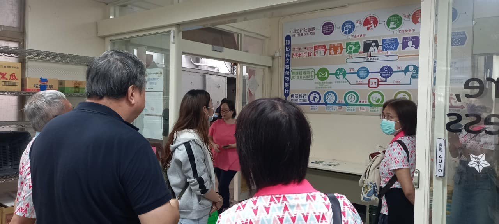
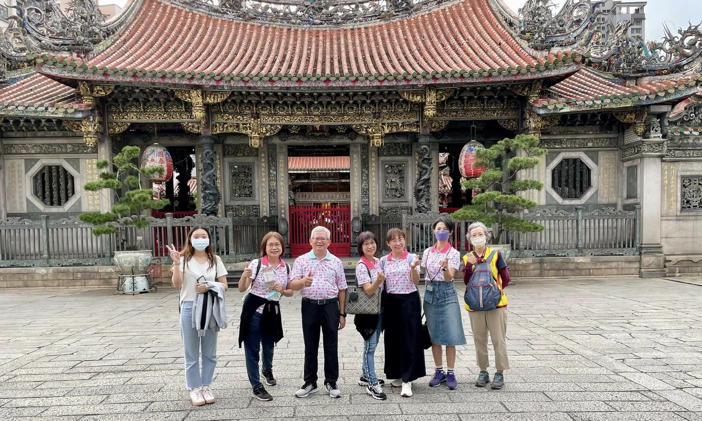

---
title: 參訪臻佶祥共享園區食物銀行學習之旅 
date: 2024-05-31 14:00:29
top: 
tags:
- [基金會參訪]
categories:
- [基金會參訪]
---------------------------------------------
# **<a href="#" style="color: #ca3333;">參訪臻佶祥共享園區食物銀行學習之旅</a>**
　　5/30本會湯執行長帶領實物銀行的工作夥伴至「臻佶祥共享園區食物銀行」參訪學習，「臻佶祥共享園區食物銀行」是由人稱「地表最強里長」方荷生里長 於2020年爭取「大我山莊」閒置國防部榮民宿舍成立。方里長連結各方宮廟、民間、企業、公益團體所捐贈的物資彙集在此，透過資源媒合、物資管理及有系統發放等模式，提供弱勢族群飲食、日常用品及衣物等相關扶助，也照顧處在「灰色地帶」的多重困難家庭與個案，並分享給需要的社區，業已成為台北食物銀行的旗艦店。 
　　特別感謝方里長百忙之中抽出時間來為我們解說，感謝共享園區卓韋辰主任暨工作夥計們毫無保留的分享。本會接受嘉義市政府委託辦理「推動嘉義市實物銀行服務計畫」雖然與方里長完全獨立自主自己做的食物銀行類型有所不同，但其為了協助弱勢族群不畏艱難、無私奉獻的精神暨聯結社會資源的超強能力，在在令人贊歎不已，是一個值得大家學習的典範。 
　　1個多小時的參訪、問答與交流，在方里長風趣爽朗的笑聲中結束。參訪學習是為了增強工作知能，並提昇服務品質。要學習的地方還很多，要走的路還很遠，「做，就對了」，互相期勉之〜 
「如果有人因為飢餓而死亡，因為貧病而失去生存的勇氣，這不是上天對他放棄，而是我們沒有伸出援手」 
收獲滿行嚢的「臻佶祥共享園區食物銀行」參訪之旅〜〜 
<!--more-->

