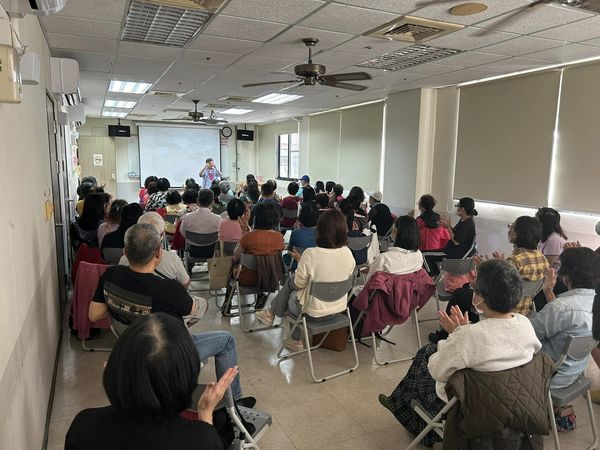

---
title: 第一場志工訓練開鑼了 
date: 2024-02-23 14:08:06
top: 
tags:
- [社區關懷據點輔導]
categories:
- [社區關懷據點輔導]
---------------------------------------------
# **<a href="#" style="color: #ca3333;">第一場志工訓練開鑼了</a>**
 財團法人王李社會福利基金會承接嘉義市政府社區關懷據點輔導計劃，辦理第一場志工訓練開鑼了，感謝教室裡滿滿的社區志工學員支持。 
 大家一起來學習，社區工作者應備有的服務態度： 
 「嘴ㄟ甜、頭ㄟ低、腰ㄟ軟、面要笑、目色利、腳手枚、心要誠、外表好、講好話、結善緣。」 
 「方法不對，努力白費。」 
<!--more-->

<video width="400" controls>
  <source src="../../../../video/WangLeeTraining.mp4" type="video/mp4">
</video>
