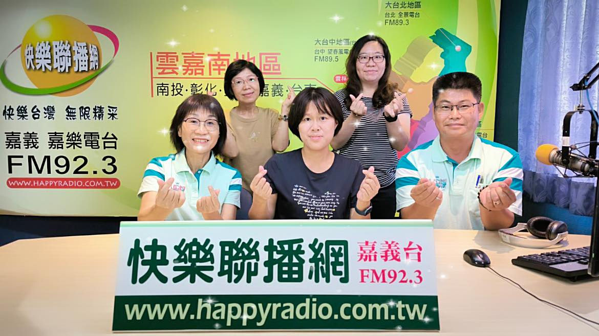

---
title: 勇媽阿惠-黃敏惠市長~~『幸福嘉義市，你我來＋１』 
date: 2024-06-26 14:18:40 
top:
tags:
- [身心障礙者自立及社會參與計畫]
categories:
- [身心障礙者自立及社會參與計畫]
---------------------------------------------
# **<a href="#" style="color: #ca3333;">勇媽阿惠-黃敏惠市長~~『幸福嘉義市，你我來＋１』</a>**
 嘉義市政府為讓身心障礙照顧服務再升級，落實身心障礙者權利公約精神，委託王李基金會辦理113年「身心障礙者自立及社會參與溫馨接送服務」，社會處及身障福利科林宜君科長偕王李基金會專案人員等至快樂聯播網嘉樂電台接受快樂雲嘉南張敏玲主持人訪談，節目中除針對本服務計畫適用對象、服務內容及申請辦法等說明外，宜君科長並表示：為體諒身心障礙朋友來回奔波之苦，勇媽阿惠-黃敏惠市長宣布，符合本計畫之服務對象，自7月份起得一次性核發6個月份之計程車乘車券。 
 服務對象 
 (1)設籍嘉義市(以下簡稱本市)且領有中度以上視覺障礙、肢體障礙或多重障礙(含視障或肢障)之身心障礙證明者。 
 (2)符合資格者每月核發計程車乘車券每張面額為50元，每月最高補助200 元，限當月有效，不得累計至次月使用。 
 應備文件： 
 1.申請表  
 2.身心障礙證明影本  
 3.國民身分證正、反面影本 
 (影本須加註「與正本相符」，並請簽名或蓋章；另需持正本供承辦單位核對。） 
 申辦時間及地點 
  1.時間：週一至週五：08:00-12:00  13:30-17:30 
     地點：嘉義市西區玉康路160號(再耕園一樓辦公室) 
      再耕園專案辦公室服務專線：05-2356175 
  2.時間：每月第一週星期一： 08:30-12:00   
     地點：嘉義市殘障者服務協會(嘉義市東區體育路2之3號) 
 3.時間：每月第一週星期二：14:00-17:00 
    地點：嘉義市肢體障礙服務協會(嘉義市民生南路280號) 
 4.時間：每月第一週星期三：08:30-12:00 
    地點：嘉義市盲人福利協進會(嘉義市新榮路225號2樓2) 
 目前參與簽約合作的計程車行(隊): 
 1.大都會平台科技股份有限公司 嘉義分公司    
 電話：0800-719999 
 (2)宏陽計程車行                
 電話: 05-2397611、   0937-656335 
 (3)吳鳳汽車交通有限公司        
 電話: 05-2397611、0937-656335 
 快樂聯播網嘉義台FM92.3 
<!--more-->

