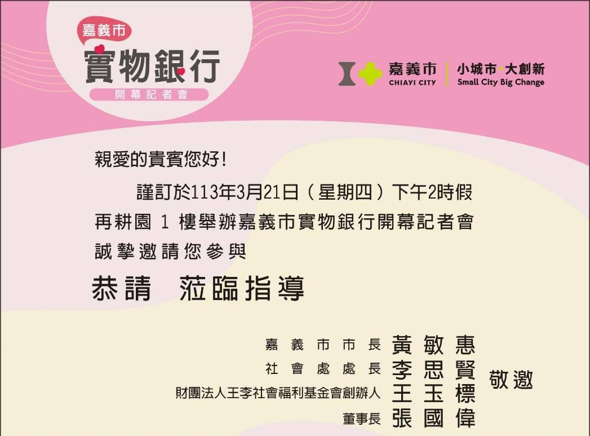
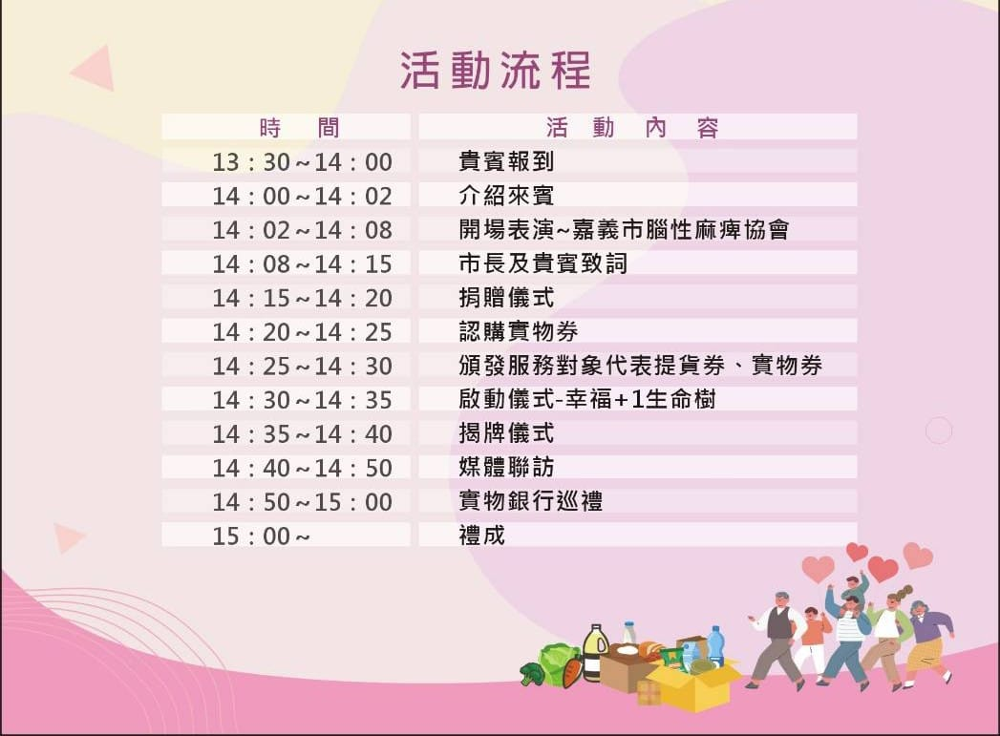
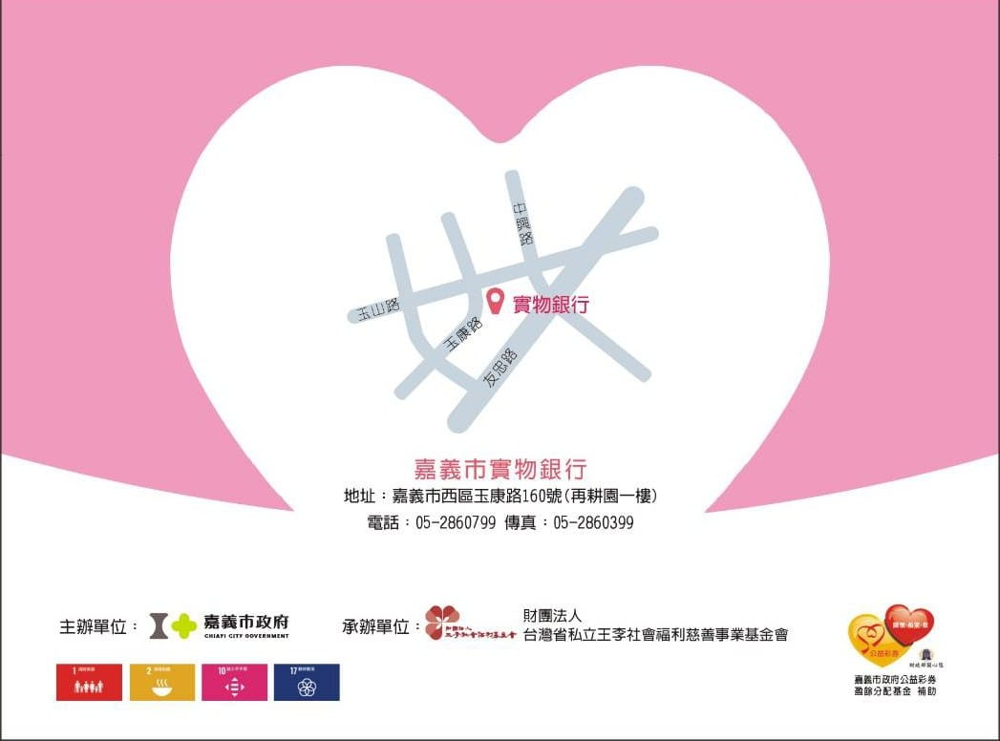

---
title: 「嘉義市實物銀行」於3月21日舉辦開幕記者會~ 
date: 2024-03-18 14:49:50
top: 
tags:
- [實物銀行]
categories:
- [實物銀行]
---------------------------------------------
# **<a href="#" style="color: #ca3333;">「嘉義市實物銀行」於3月21日舉辦開幕記者會~</a>**
 王李社會福利基金會自113年1月起承辦嘉義市政府委託辦理「嘉義市實物銀行服務計畫」，服務對象經市政府社安網、脆家等社福單位轉介，經社工評估符合服務資格者，提供各種民生用品、食品或全聯提貨劵等服務，期限依服務對象條件暨社工評估結果提供一次性或短期6個月之服務；3月份起更結合各方善士及愛心店家提供「實物餐券」服務，以擴大服務全市的脆弱家庭。 
 「嘉義市實物銀行」設置於再耕園1樓，訂於3月21日（四）舉辦開幕記者會，邀請各界善士暨實物餐券合約店家共襄盛舉，實物餐券每張面額80元，合約店家目前有：劉里長雞肉飯、世洲排骨便當、三哥食品行、嘉義市腦麻協會麻吉烘焙坊及若竹兒愛心商店等。冀望有更多的善心店家加入提供餐食服務，更需要更多的善心人士捐助支持參與，邀請您ㄧ起來幫助弱勢家庭，讓脆弱家庭能受到更周全的照顧。 
 服務時間： 
 周一至周五上午8:00-1200 
                     下午13:30-18:00 
 周六上午8:00-12:00 
 地址：嘉義市西區玉康路160號101室（再耕園1樓） 
 電話：05-2860799 
 社工人員：社工師 林妙諭、社工員 邱慧娟 
<!--more-->

