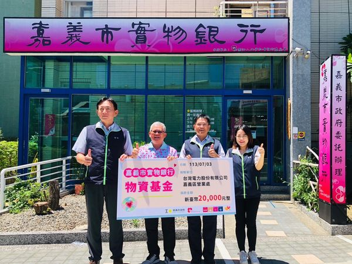
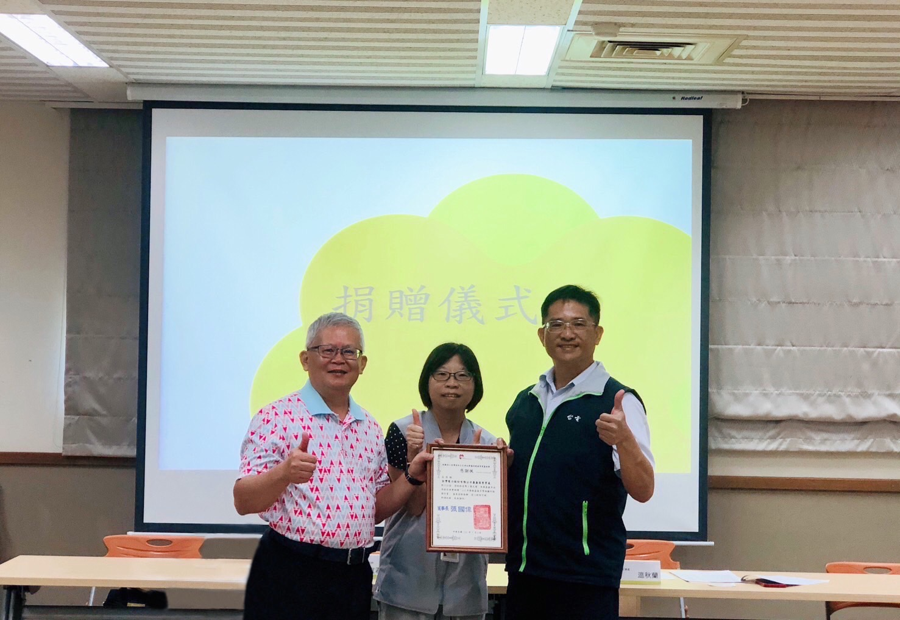
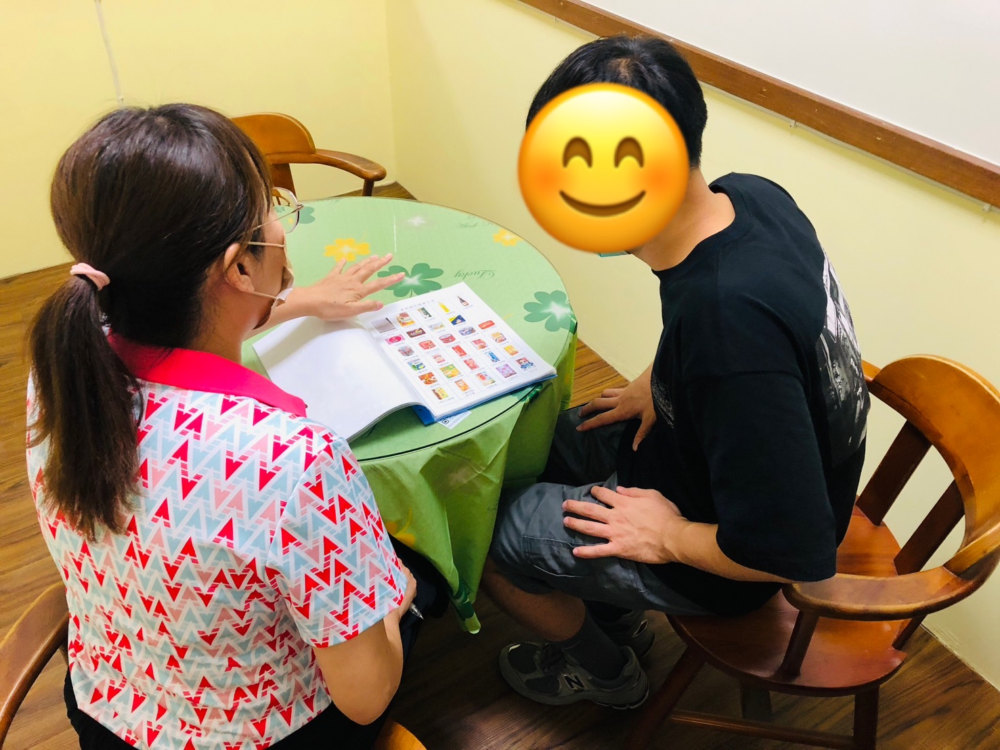
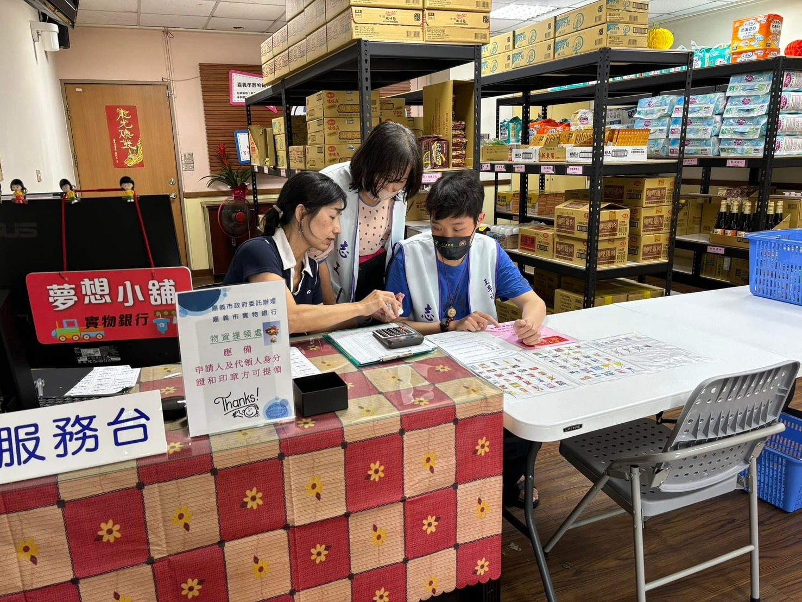
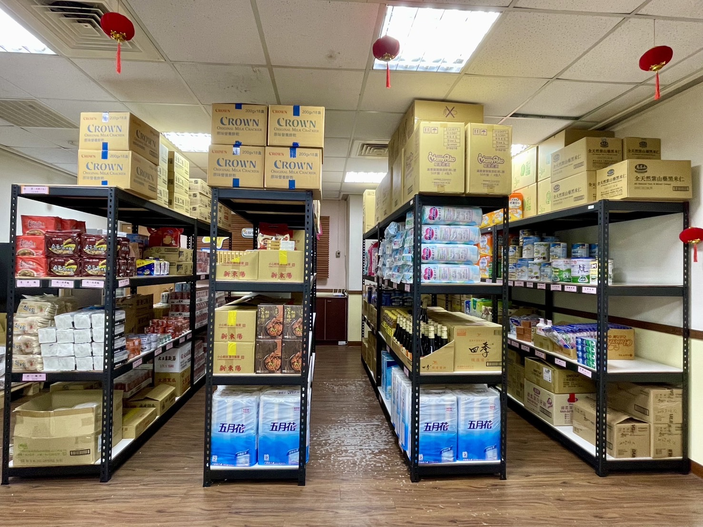

---
title: 實物銀行服務「嘉倍」 嘉市府攜手善心店家助弱勢 
date: 2024-07-04 14:53:36
top: 
tags:
- [實物銀行]
categories:
- [實物銀行]
---------------------------------------------
# **<a href="#" style="color: #ca3333;">實物銀行服務「嘉倍」 嘉市府攜手善心店家助弱勢</a>**
 【諸羅新媒 劉芳妃/嘉市 報導】今(113)年1月起嘉義市政府委託財團法人台灣省王李社會福利慈善事業基金會辦理實物銀行，於再耕園成立實體店面，透過配置充沛專業人力、溫馨充裕的實物銀行空間及每月開放達26天的領取時間，從112年每月服務戶數約88戶，至今年6月提升為163戶，服務戶數持續增加，顯見經濟弱勢民眾對於物資的需求，今年度提供的加值服務為依家戶經濟狀況加發實物餐券及提供新生兒幸福包，目前實物餐券合約店家有嘉義市腦麻協會麻吉烘培坊、劉里長雞肉飯店、世洲排骨飯便當、若竹兒愛心商店、三哥食品行、多那之複合式咖啡蛋糕烘培、福源肉粽店，希望有更多的善心店家加入提供餐食服務，支持嘉義市經濟弱勢家庭免於挨餓。 
 台電嘉義區處長許墩貴帶領同仁到「嘉義市實物銀行」捐贈2萬元物資基金，讓弱勢家庭感到溫暖，帶動社會扶弱濟貧的善良風氣。嘉義市政府社會處李思賢處長感謝台電嘉義區處展現熱心公益、服務社會的情操，對社會處和弱勢族群的支持，未來更期盼大家能拋磚引玉，加入慈善關懷行動行列，一起合作更多的公益事項，為地方社會發展貢獻力量。 
 台灣電力公司嘉義區營業處許墩貴處長指出，台電分享誠信、關懷、服務、成長之經營理念，結合社會資源，努力落實企業社會責任，長期關注公益，去年除贊助嘉義基督教醫院舉辦長照野餐日活動經費、捐贈老人食堂環保餐盒、與鄉鎮公所合作協助偏鄉民眾老屋線路汰換外，今年亦協助嘉義縣物資銀行購置0-2歲嬰幼兒所需食用品，藉由持續不斷地參與慈善活動，落實台電公司散播愛心傳遞溫情的行動力，為支持嘉義市經濟弱勢家戶免於挨餓，希望能夠透過此次捐贈，提供一些實際幫助給有需要的人士。 
 財團法人台灣省王李社會福利慈善事業基金會湯宏忠執行長表示，有物資需求的市民，可經市府社工人員、居住地區公所、里長及里幹事轉介或自行至實物銀行申請，經實物銀行社工評估並符合服務資格者，每戶每月核發1,000點可自行選擇所需物資，服務期限6個月，並視家戶經濟狀況加發提貨券或實物餐券。嘉義市實物銀行再耕園實體店面：嘉義市西區玉康路160號101室；服務時間：週一至週五8:00-12:00及13:30-18:00，週六8:00-12:00；服務專線：05-2860799。另設置東區據點：嘉義市東區大雅路二段234巷20號)；服務時間：每月開放第二週及第四週週二(國定假日順延一天)8:00-12:00、13:30-17:30；服務專線05-2770779。 
<!--more-->

