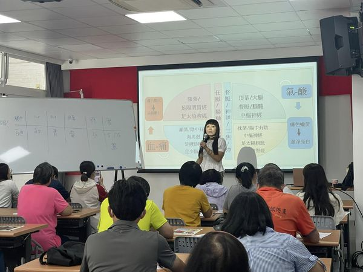
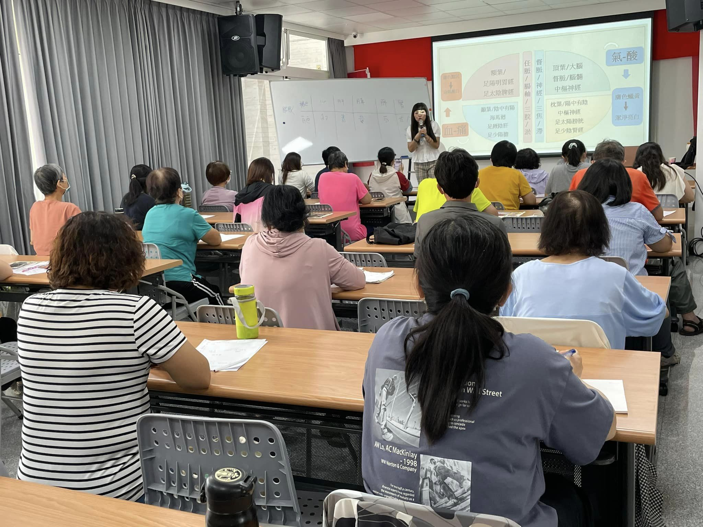
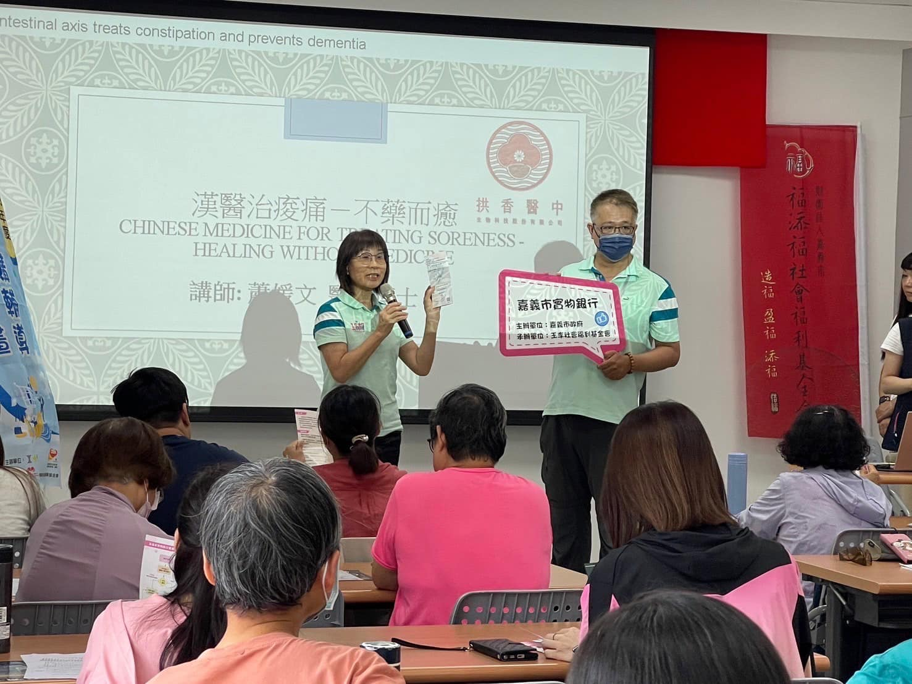
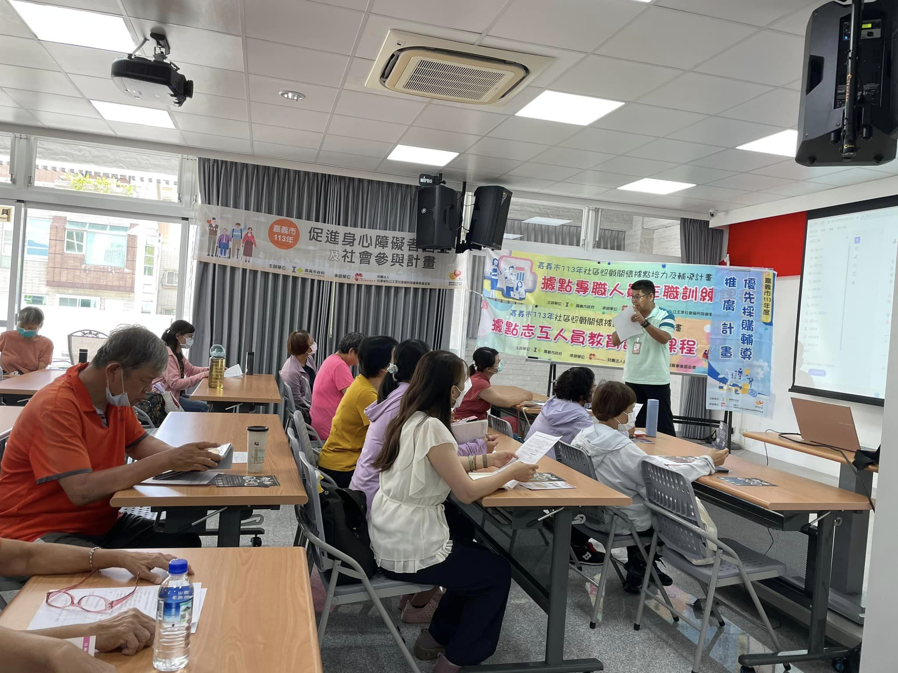
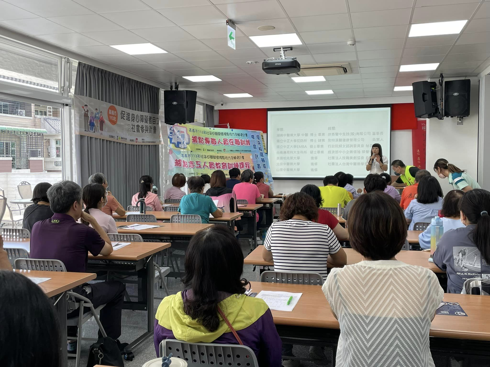
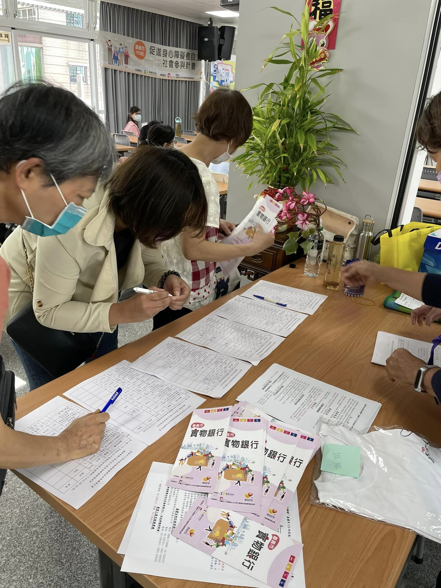
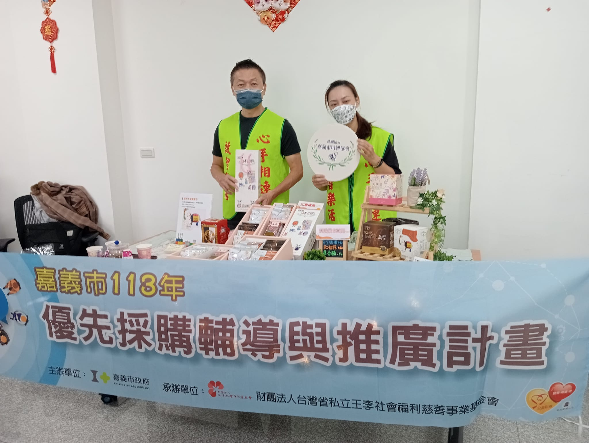
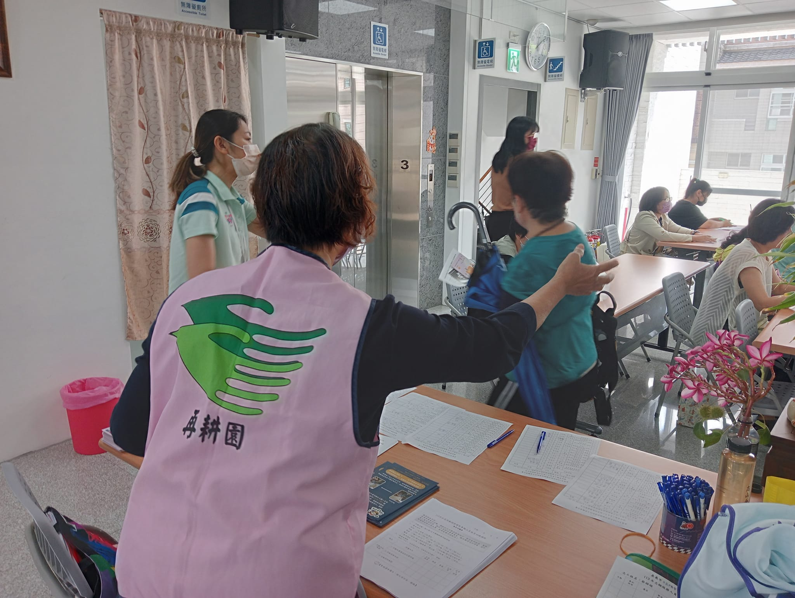

---
title: 認真的男人最帥、認真的女人最美 
date: 2024-07-13 14:55:52
top: 
tags:
- [基金會宣導]
categories:
- [基金會宣導]
---------------------------------------------
# **<a href="#" style="color: #ca3333;">認真的男人最帥、認真的女人最美🎉🎉🎉</a>**
 　　嘉義市目前有39個社區關懷據點，分散在嘉義市轄內的各個角落，除提供長輩們關懷、照顧與陪伴外，各據點的工作夥伴與志工朋友更是協助政府推廣各項福利服務措施的重要一員。 
 　　王李基金會的工作夥伴們總是利用各種機會用力的宣導嘉義市政府委託辦理的各項福利服務計畫，期能使符合服務的對象皆能獲得適切的服務，方不辜負政府推動各項福利服務措施的良法美意。 
 　　王李基金會接受嘉義市政府委託辦理社區關懷據點培力與輔導計畫，7/12假福添福基金會會議室辦理社區關懷據點專職人員暨志工培訓課程，邀請拱香醫中蕭媛文醫學博士 主講「漢醫治酸痛—不藥而癒」，蕭博士結合中醫、穴道、飲食、節氣⋯，生動活潑、實用有趣的課程內容，讓大家都覺得欲罷不能，收穫滿滿。 
 　　上課前，王李基金會的帥哥美女也借用老師一些時間，輪番上台介紹相關身障者自立與社會參與溫馨交通接送及推動實物銀行服務計畫，優採輔導與推廣計畫 並媒合 #嘉義市啟智協會再耕園保康清潔​隊於現場設攤及宣導本市8家優採單位的產品與服務⋯ 
 　　圓圓滿滿的一個下午，感謝大家的互相成就。 
 謝謝🙏 
<!--more-->

