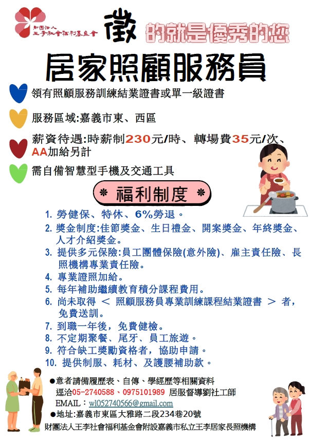
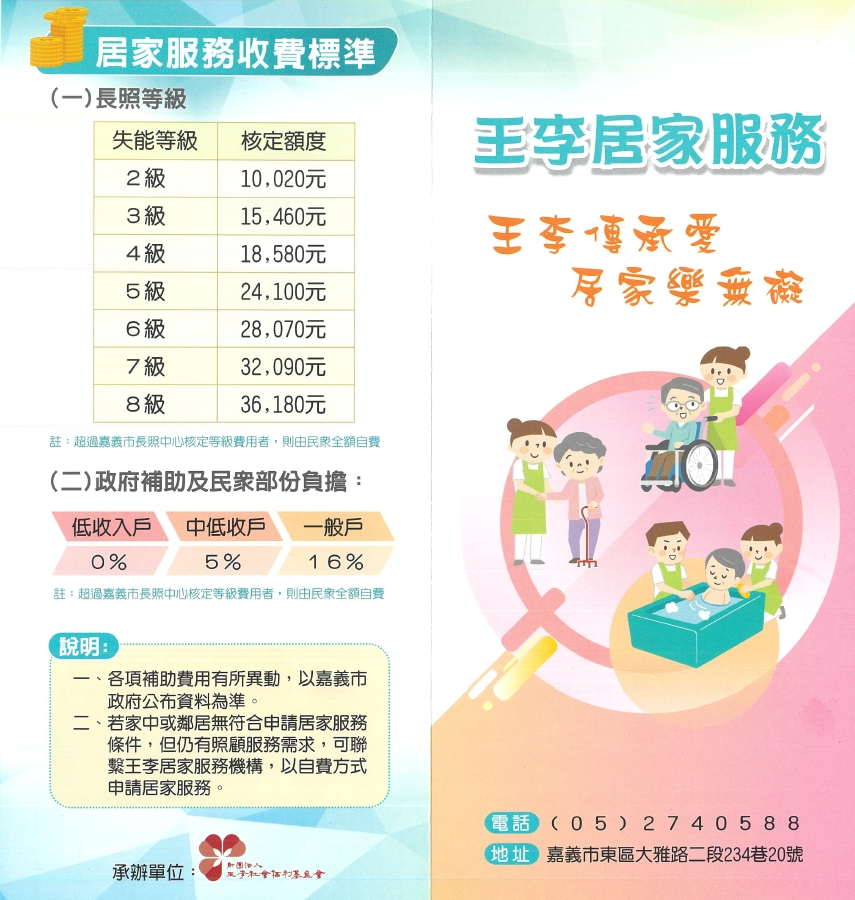
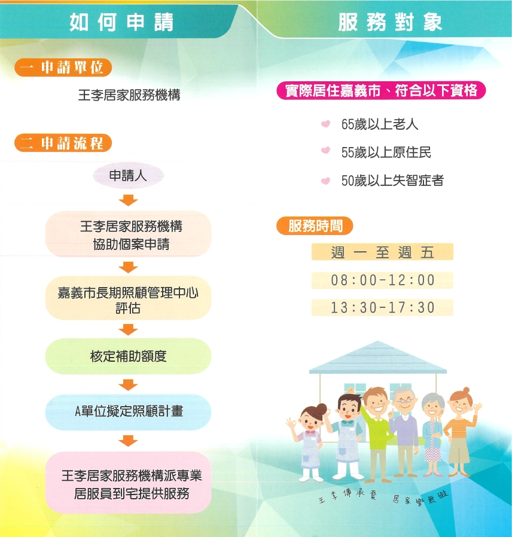

---
title: 王李傳承愛 居家樂無礙 ~ 王李居家服務工作開展囉!
date: 2024-10-17 16:40:39 
top: 1
tags:
- [居家服務]
categories:
- [居家服務]
---------------------------------------------
# **<a href="#" style="color: #ca3333;">王李傳承愛 居家樂無礙 ~ 王李居家服務工作開展囉!</a>**
 　　長期照顧服務是指針對預期或已達六個月以上無法生活自理的民眾，由長照服務人員及單位，提供各種照顧及專業服務(包含居家服務、日間照顧、家庭托顧、小規模多機能服務、專業服務)、輔具租借、購買及居家無障礙環境改善、交通接送及喘息服務等。 
 　　長期照顧服務對於被照顧者本人或是家屬而言，都可能承受極大的經濟與心理壓力。若您打算在家親自照顧家人，或是聘僱外籍看護工，都可以使用「長照2.0」，經評估符合資格者，有政府提供的長照服務資源與補助，減輕長照的負擔！ 
 如有相關長期照顧服務的需求都可洽王李居家長照機構哦! 
  
 王李居家長照機購 
 服務區域：嘉義市 
 服務電話：05-2740588 
 服務地址：嘉義市東區大雅路二段234巷20號 
 歡迎有志居家服務工作的你/妳 加入王李居家服務團隊  
 一起為有長期照顧服務的民眾提供各項服務哦! 
<!--more-->

