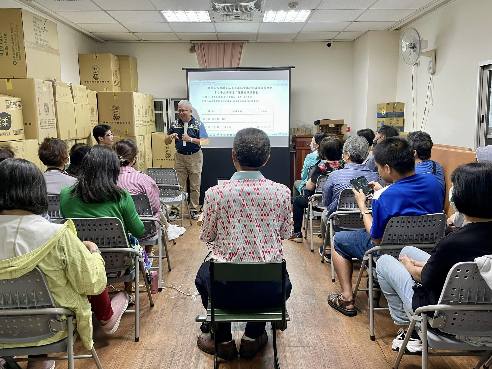
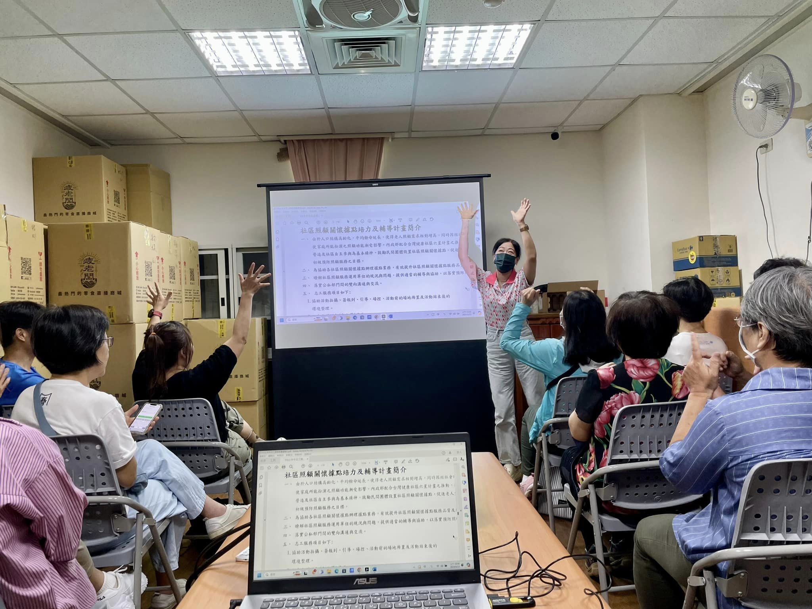
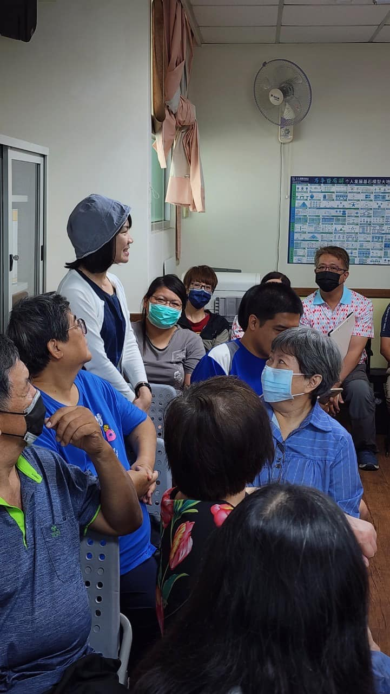
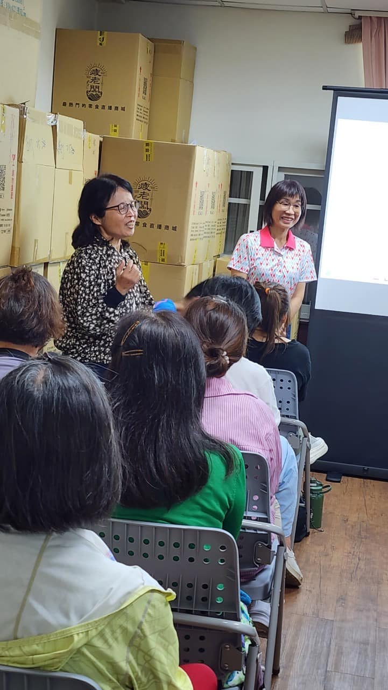
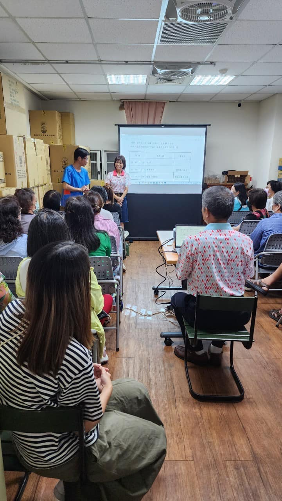
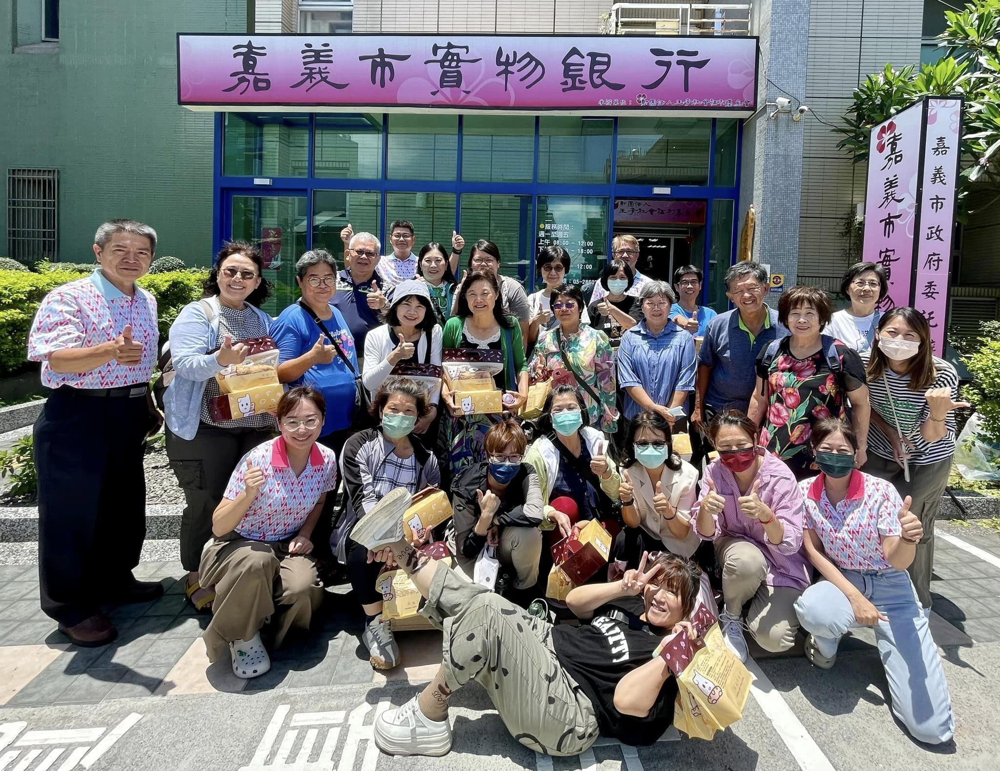

---
title: 王李基金會於今日（6/15）召開上半年志工隊隊務會議 
date: 2024-06-15 16:54:59
top: 
tags:
- [實物銀行]
categories:
- [實物銀行]
---------------------------------------------
# **<a href="#" style="color: #ca3333;">王李基金會於今日（6/15）召開上半年 志工隊隊務會議</a>**
 　　王李基金會於本(113)年初接受嘉義市政府委託辦理「113年推動嘉義市實物銀行服務計畫」，感謝志工伙伴們每天排班協助發放及整理物資等工作，目前實物銀行透過每月發放物資的方式援助清寒弱勢家庭截至本(113)年5月底止援助個案共計529戶，志工服務人次共計156人次。 
 王李基金會113年接受嘉義市政府委託辦理之方案計畫計下列四項：  
 　推動嘉義市實物銀行服務計畫  
 　社區照顧關懷據點培力及輔導計畫  
 　促進身心障礙者自立及社會參與計畫 
 　優先採購輔導與推廣計畫 
 上列各項方案在辦理各項相關活動與支援工作時，均需志工伙伴的協助與幫忙。 
 助人最樂服務最榮 
 志願者是一盞燈照亮別人的同時也溫暖了自己 
 感謝每一位志工夥伴～有你真好 
<!--more-->

