---
title: 王李基金會接受嘉義市政府委託辦理嘉義巿113年優先採購輔導與推廣計畫 ~ 
date: 2024-06-14 17:15:22
top:
tags:
- [優先採購輔導與推廣]
categories:
- [優先採購輔導與推廣]
---------------------------------------------
# **<a href="#" style="color: #ca3333;">王李基金會接受嘉義市政府委託辦理嘉義巿113年優先採購輔導與推廣計畫 ~</a>**
 今(14)日13：30假再耕園4樓國際會議廳，舉辦113年優先採購教育訓練暨優採廠商聯合展覽推廣會，由社會處救助及身障福利科林宜君科長出席主持，會中邀請啟智協會、腦麻協會、嘉愛啟智發中心、晨光智能發展中心、再耕園咖啡庇護工場、再耕園保康清潔隊、立宇庇護工場、清健庇護工場等8家優採單位，現場也結合設攤，向各級機關學校及與會人員宣導介紹優採單位的特色及用心生產的產品，讓義務採購單位及社會大眾對於本市各身心障礙福利機構團體或庇護工場所提供之產品及服務更加熟悉了解，提升產品之能見度及採購意願，以協助更多的身障礙者自立自強，提供更多的就業機會。 
<!--more-->

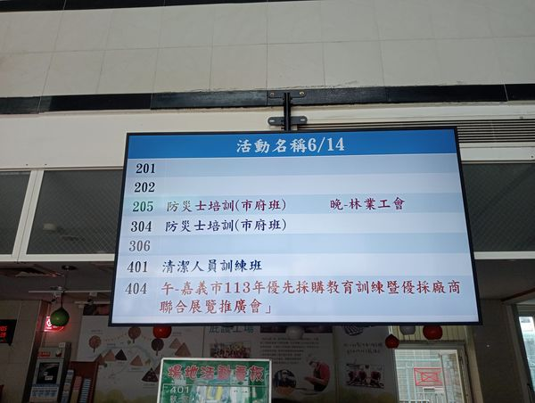

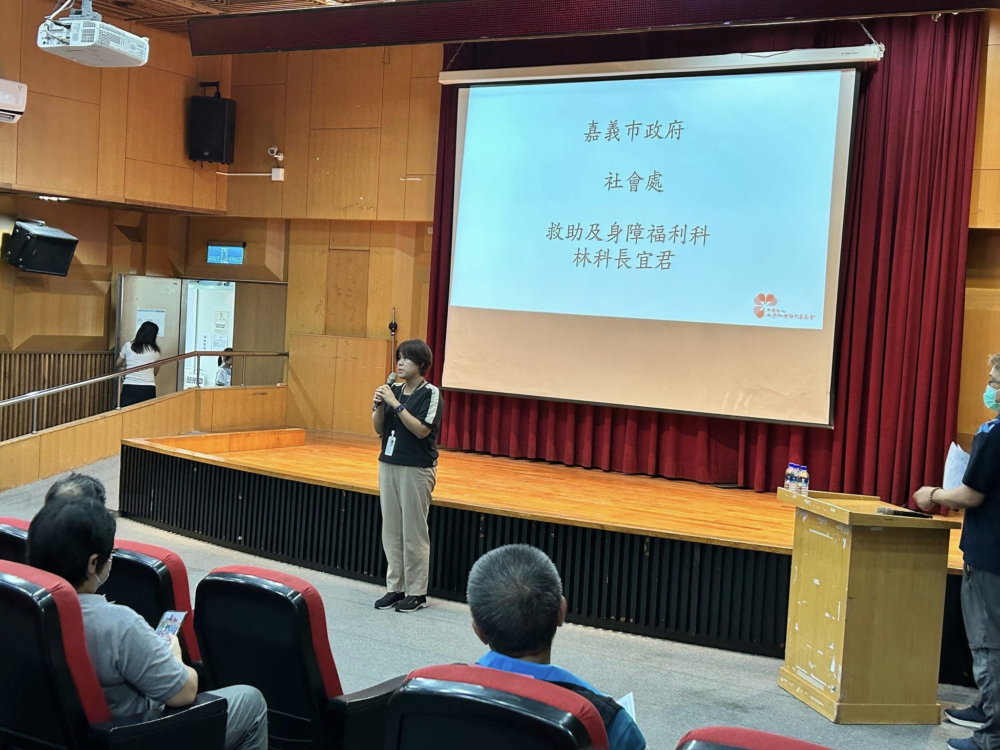

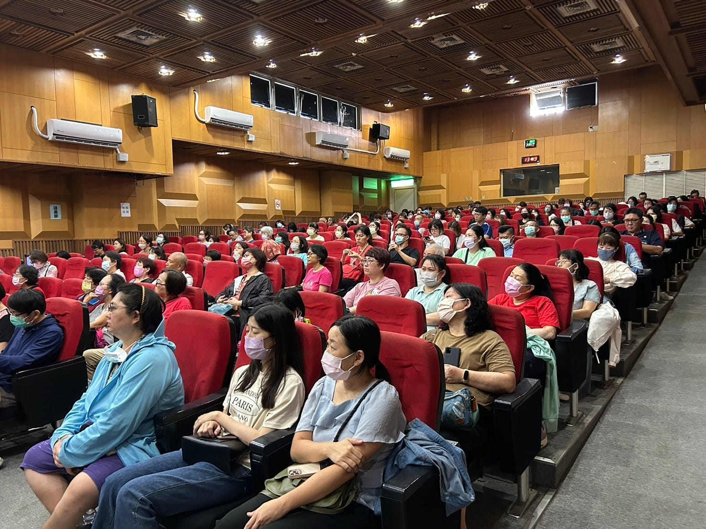

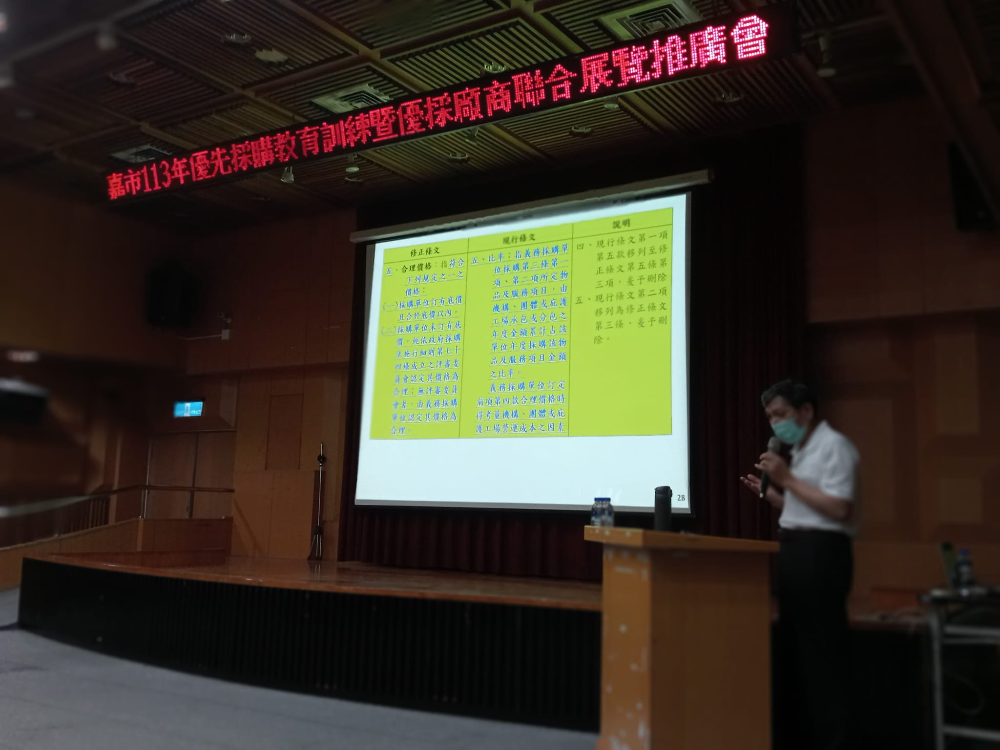

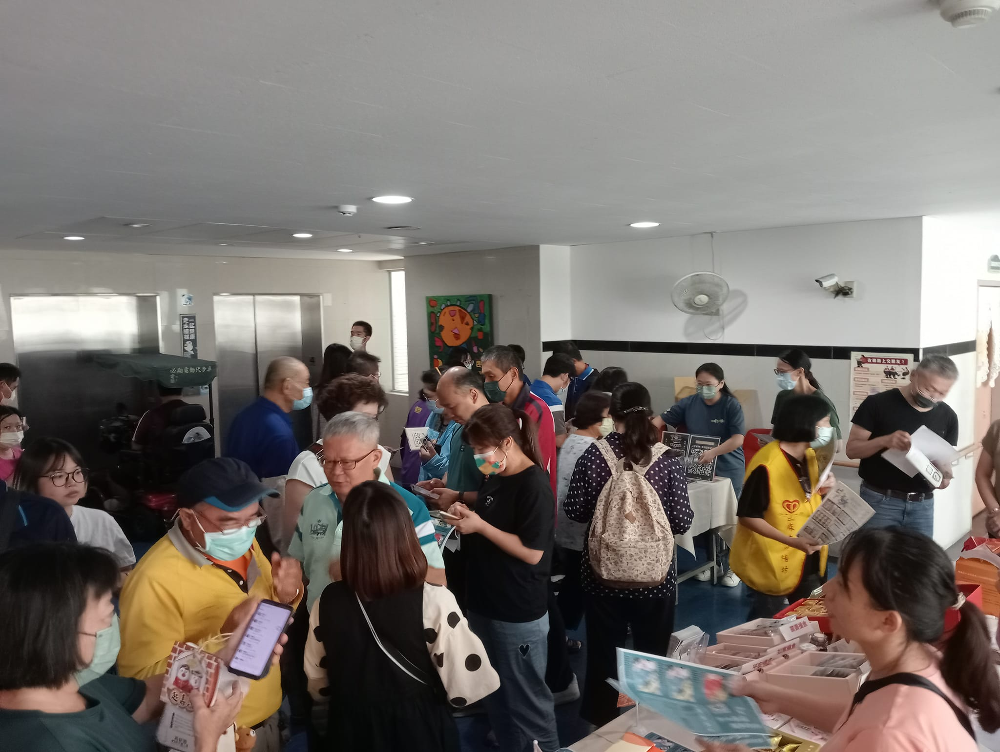

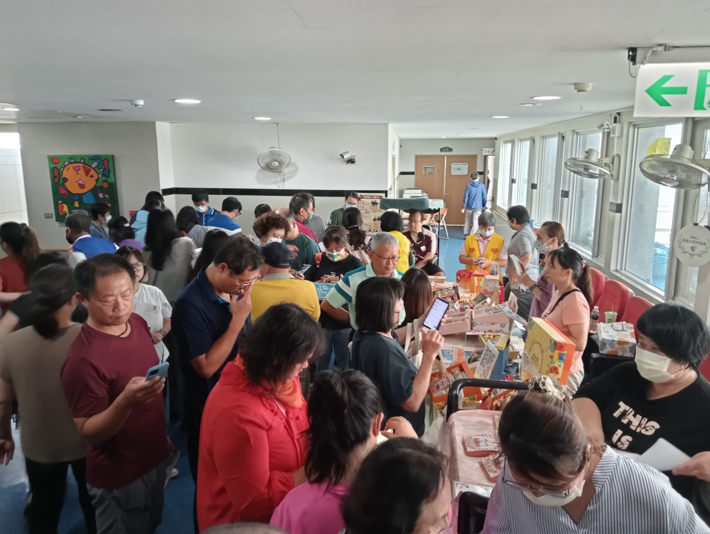

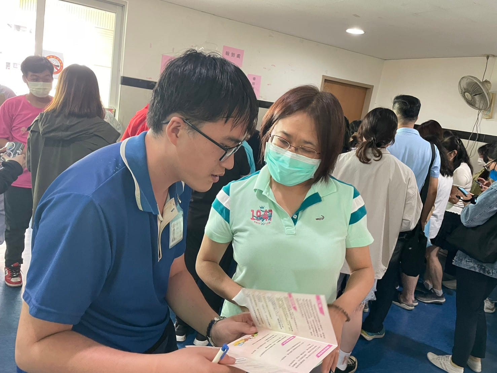

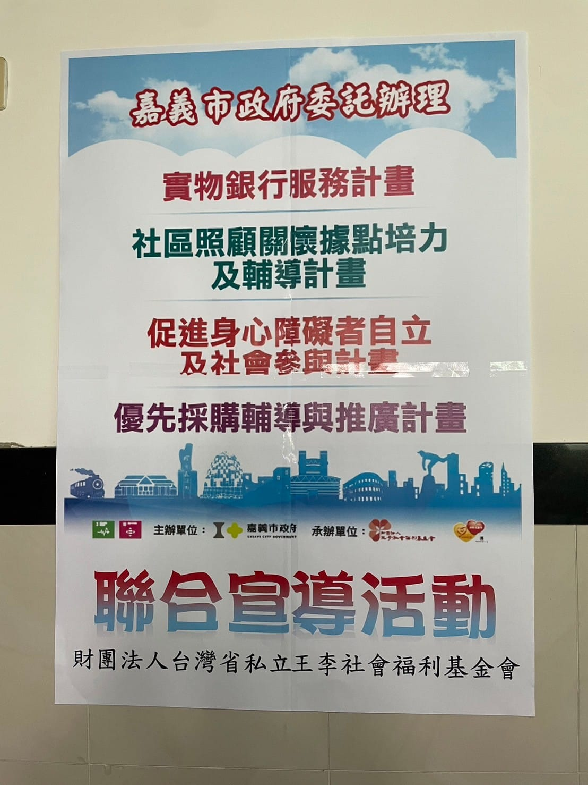

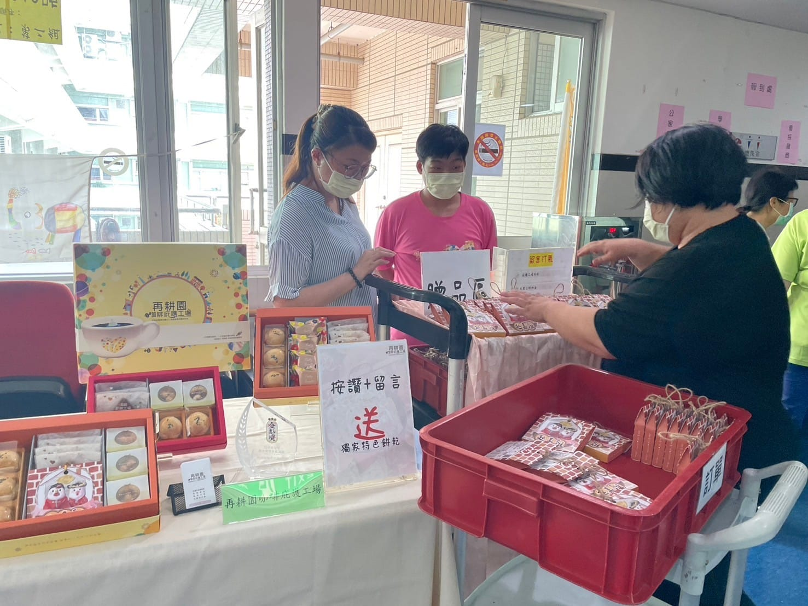

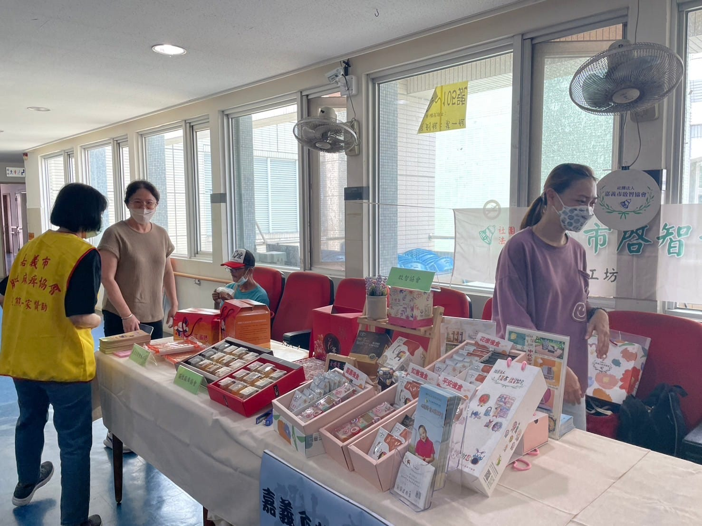

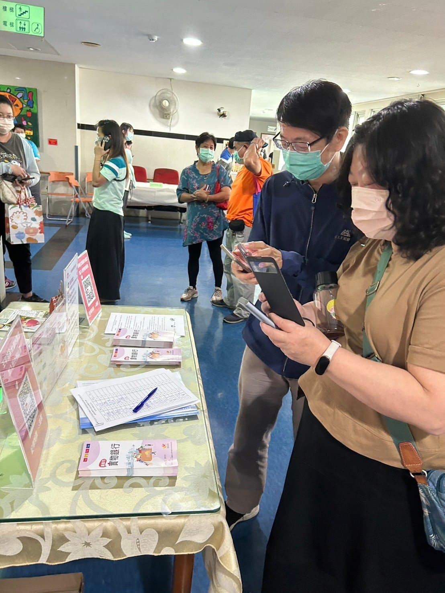
