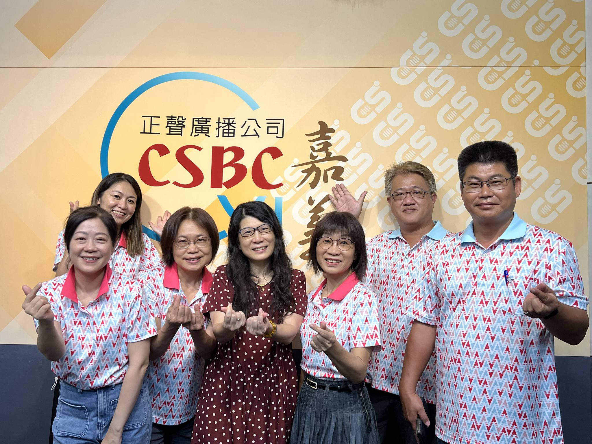
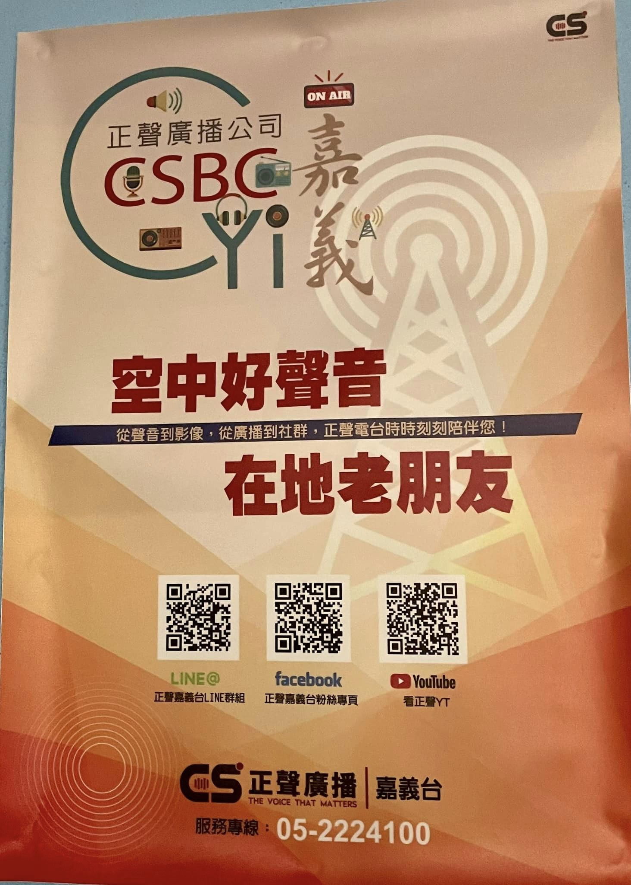
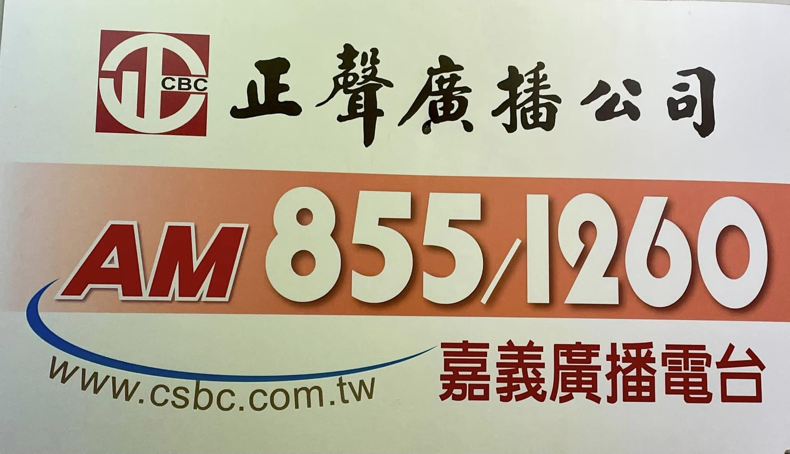
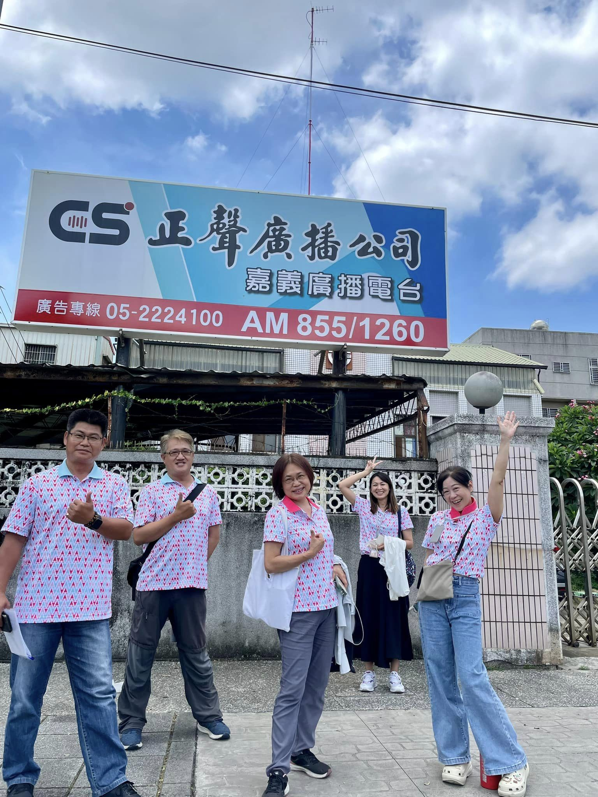

---
title: 正聲廣播公司嘉義廣播電台宣導基金會各項服務計畫 
date: 2024-06-28 13:45:11 
top:
tags:
- [基金會宣導]
categories:
- [基金會宣導]
---------------------------------------------
# **<a href="#" style="color: #ca3333;">聲廣播公司嘉義廣播電台宣導基金會各項服務計畫</a>**
 感謝🙏 正聲廣播公司嘉義廣播電台諸羅采風主持人怡妙科長的邀約，王李基金會 的工作夥伴6/27至正聲電台就113年接受嘉義市政府委託辦理的各項服務計畫進行訪談，期待藉由廣播節目的播出，能讓更多的嘉義市民更了解相關嘉義市實物銀行身障者自立溫馨交通接送計程車🚕券補助社區關懷據點培力輔導及身障機構團體及庇護工場優採等各項服務計畫的內容，共創幸福美好的嘉義市❤️ 
<!--more-->

