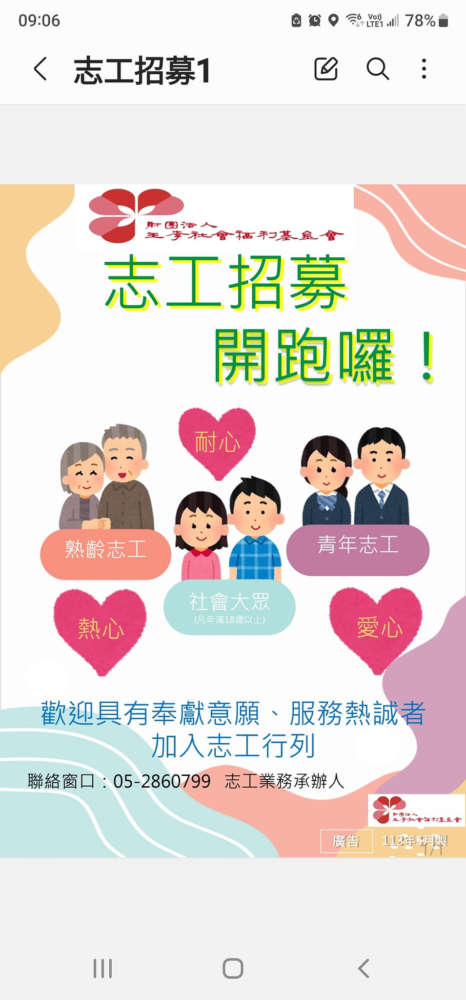

---
title: 財團法人王李社會福利基金會志工隊 
date: 2024-05-18 14:01:35 
top: 2
tags:
- [社區關懷據點輔導]
categories:
- [社區關懷據點輔導]
---------------------------------------------
# **<a href="#" style="color: #ca3333;">財團法人王李社會福利基金會志工隊</a>**
　　志工招募開跑囉！歡迎您加入「王李志工隊」的行列！ 
王李基金會為擴大照顧更多弱勢家庭，自113年1月起陸續接受嘉義市政府委託辦理嘉義市實物銀行、社區關懷據點培力及輔導計畫、優先採購輔導與推廣計畫、身心障礙者自立及社會參與計畫等社會福利服務方案。 
　　實物銀行剛成立不久，各項方案也都剛起步，亟需號召更多志工人力的投入，共同為弱勢家庭服務，並提供在地化、就近性、立即性的服務，一起攜手點燃生命的光茫，讓幸福傳遞嘉義市每個角落。 
 
招募對象： 
　1.年滿18歲。 
　2.願意秉持志願服務的精神。 
　3.具開放的心胸，喜歡與人接觸相處。 
　4.具備獨立自主的能力。 
 
服務內容： 
　1.協助實物銀行物資分類整理暨發放等事宜。 
　2.協助本會各項服務方案活動或教育訓練課程之進行事宜。 
　3.臨時需要服務之其他事項。  
 
服務時間： 
　1.實物銀行 
　　每週一到五：　08:30-11:30，13：30-16:30 
　　每週六　　：　08:30-11:30 
　2.其他各項方案活動或課程之進行，依實際所需時間另予安排。 
 
服務地點： 
　1.西區據點：嘉義市玉康路160號一樓 
　2.東區據點：嘉義市東區大雅路二段234巷20號 
　3.各項方案活動或課程進行之地點。 
 
【報名方式】 
　報名電話：05-2860799 
　報名地點：嘉義市玉康路160號一樓(嘉義市實物銀行) 
　承辦人員：鄭健得 
 
如有意願報名都歡迎來電與我們連繫！期待您的加入！報名後承辦人將以電話跟您聯繫，瞭解您可以服務的時間，正式完成報名。 
財團法人台灣省私立王李社會福利慈善事業基金會  謝謝 
<!--more-->

